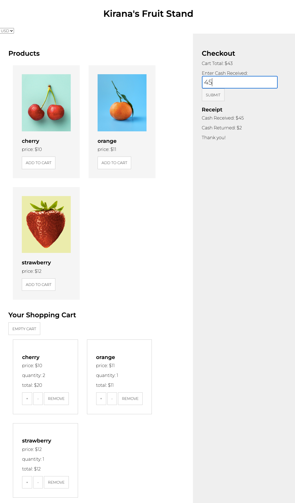

# Udacity Shopping Cart Site

## Overview
This project is a simple shopping cart web application built to demonstrate front-end web development techniques as part of the Udacity Full Stack Web Developer Nanodegree. It features a fully interactive cart where users can add, remove, or adjust the quantity of products.

## Features
- **Add Products to Cart:** Users can add products to their cart from the product list.
- **Adjust Quantity:** Users can increase or decrease the quantity of items in their cart.
- **Remove Products:** Users can remove items from their cart.
- **Dynamic Cart Total Calculation:** The total price updates dynamically as items are added or removed.
- **Responsive Design:** The site is built to be responsive across various devices and screen sizes.

## Technologies Used
- HTML
- CSS
- JavaScript

## Getting Started

### Prerequisites
Before running this project, you need to have Node.js installed on your system. You can download and install Node.js from [Node.js official website](https://nodejs.org/).

### Installation
Clone the repository to your local machine:
```bash
git clone https://github.com/amnotme/Udacity_Shopping_Cart_Site.git
cd Udacity_Shopping_Cart_Site
```

### Install packages

```bash
npm install
```

### Start Application

```bash
npm run start
```

### Run Tests

```bash
npm run tests
```

### Shopping Cart Mock

